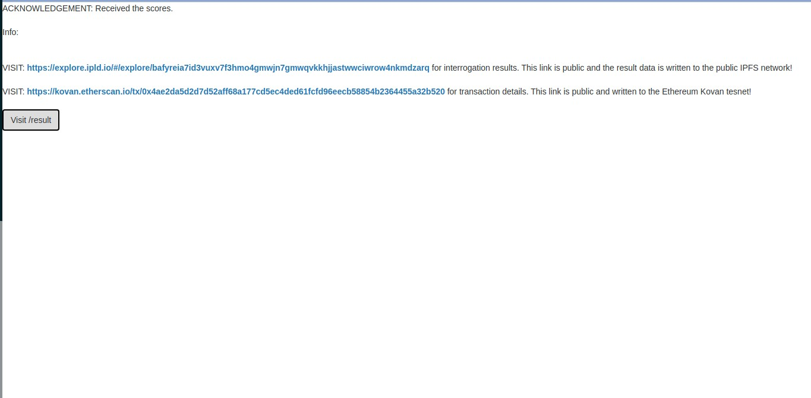

# Turing test EXtended Architecture (TEXA): A method for interacting, evaluating and assessing AI in a multi-context environment

[](https://travis-ci.org/TexaProject/texa)

TEXA is a novel testing and benchmarking framework backed by a simple [mathematical theory](https://github.com/TexaProject/texa-docs). It can be used to interact, evaluate and assess AIs that work in multi-context environments. 

In simple terms, TEXA enhances the concept of Turing testing by allowing the tester to assign a binary score to each and every interaction with the machine. This will allow us to quantify the quality of our models and contrast them between multiple contexts.

TEXA is a novel framework backed by a mathematical oriented theory(Texa Theory, refer to /texa-docs) for interacting, evaluating and assessing AIs. 

#### We are helping answer an important question: _"What's real and what's not?"_


## LIBRARIES USED:

The system uses a number of open source projects to work properly:

* [texalib](https://github.com/TexaProject/texalib) - Special Math library written from scratch for TEXA
* [texajson](https://github.com/TexaProject/texajson) - Dedicated JSON interpreter library that serves as interface to  native Datastore.
* [store](https://github.com/TexaProject/store) - To interact with the Ethereum blockchain
* JS - evented I/O for the backend
* jQuery - duh
* [ElizaBOT-JS](https://www.masswerk.at/elizabot/) - Javascript implementation of the ELIZA specification by Weizenbaum, 1966. Special thanks to Landsteiner!


## Installation:

### Go:

TEXA is written in [Go](http://golang.org) v1.7+. If you don't have a Go
development environment, please [set one up](http://golang.org/doc/code.html).

### Redis: 

TEXA uses Redis to store all the mathematical data used by the texalib package, depended by the TEXA API. You can [install redis](https://redis.io/topics/quickstart#redis-quick-start) and learn more about redis [here](https://redis.io/).

### MongoDB:

TEXA persists all your chat history in a local MongoDB instance, keeping your interrogation data private. You can install [MongoDB](https://docs.mongodb.com/manual/installation) and learn more about MongoDB [here](https://docs.mongodb.com/manual/tutorial/getting-started).

Check your version using the command:
```sh
$ go version
```

If go is installed, please make sure that you have a redis instance running on the default port. You can simply run one using the following command:

```sh
$ docker run --name redis-test-instance -p 6379:6379 -d redis
```

Once redis is running, make sure that you have created a config.json secret file on your local repo root folder. Here is an example content:

```json
{
    "ethereum_rpc_endpoint": "https://kovan.infura.io/v3/<YOUR-INFURA-TOKEN-GOES-HERE>",
    "wallet_privatekey": "<YOUR-ETH-WALLET-PRIVATE-KEY>",
    "storage_contract_address": "0x611ef1c4f63b5808535715120ace298a7de835b6"
}
```

Once you have Installed the dependencies, you may start the server:

```sh
$ go run main.go
```

Now, read the Section 7 "SNAPSHOTS AND RESULTS" in the [whitepaper](https://github.com/TexaProject/texa-docs/blob/master/TEXA%20-%20Project%20Report.pdf) to understand the usage manual of this system.

If you interact with the system as instructed in the whitepaper, the results of the interrogation session will be written to the public IPFS. The hash of the content on IPFS is used as the data to sign a new transaction on Ethereum Kovan blockchain.
When the results are posted on IPFS and committed to the Ethereum blockchain, you'll receive 2 public links as shown below:

These links are valid and remain useful until public IPFS and ethereum kovan testnet exists. This is a small demonstration of how AI and its testing process could be democratized using blockchain and other decentralized technologies.

## TODO (Future Work)

- Needs testing
- Lacks complete support for non-Eliza AIs(non-JS reference implementations through APIs).
- APIs can be exposed to build use-cases such as ranking apps etc.
- Feel free to try new ideas!


### License
----

Apache 2.0 on the demonstrated work.
Derived work carry respective Licenses. Please refer the links.
